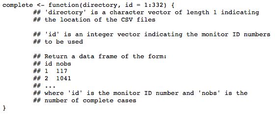

```{r setup, include=FALSE}
knitr::opts_chunk$set(echo = TRUE)
```

# Assignment Description

Below is the description of the assignment. It is copied from its source [here](https://www.coursera.org/learn/r-programming/supplement/amLgW/programming-assignment-1-instructions-air-pollution).

### Introduction

For this first programming assignment you will write three functions that are meant to interact with dataset that accompanies this assignment. The dataset is contained in a zip file **specdata.zip** that you can download from the Coursera web site.

Although this is a programming assignment, you will be assessed using a separate quiz.

### Data

The zip file containing the data can be downloaded here:

* [specdata.zip [2.4MB]](https://d396qusza40orc.cloudfront.net/rprog%2Fdata%2Fspecdata.zip)

The zip file contains 332 comma-separated-value (CSV) files containing pollution monitoring data for fine particulate matter (PM) air pollution at 332 locations in the United States. Each file contains data from a single monitor and the ID number for each monitor is contained in the file name. For example, data for monitor 200 is contained in the file "200.csv". Each file contains three variables:

* Date: the date of the observation in YYYY-MM-DD format (year-month-day)
* sulfate: the level of sulfate PM in the air on that date (measured in micrograms per cubic meter)
* nitrate: the level of nitrate PM in the air on that date (measured in micrograms per cubic meter)

For this programming assignment you will need to unzip this file and create the directory 'specdata'. Once you have unzipped the zip file, do not make any modifications to the files in the 'specdata' directory. In each file you'll notice that there are many days where either sulfate or nitrate (or both) are missing (coded as NA). This is common with air pollution monitoring data in the United States.

### Part 1

Write a function named 'pollutantmean' that calculates the mean of a pollutant (sulfate or nitrate) across a specified list of monitors. The function 'pollutantmean' takes three arguments: 'directory', 'pollutant', and 'id'. Given a vector monitor ID numbers, 'pollutantmean' reads that monitors' particulate matter data from the directory specified in the 'directory' argument and returns the mean of the pollutant across all of the monitors, ignoring any missing values coded as NA. A prototype of the function is as follows.


You can see some example output from this function below. The function that you write should be able to match this output. Please save your code to a file named pollutantmean.R.

[pollutantmean-demo.html](https://d3c33hcgiwev3.cloudfront.net/_3b0da118473bfa0845efddcbe29cc336_pollutantmean-demo.html?Expires=1579046400&Signature=QcID-GyJcmvOfSgH1vBjpzey2GPFIx1AN3XVyFfB97I0piR~b9pyszRVYQO1cVfweRctxarm0ZHY52oqv0AW7f24p9SB1tiukGRlxzOAnNE4KgoUl2gFb8FXmvQIWOtfqjx2PAJrdVfmKp73Z4iT652SHlB17h8o22kwmJsNWiQ_&Key-Pair-Id=APKAJLTNE6QMUY6HBC5A)

### Part 2

Write a function that reads a directory full of files and reports the number of completely observed cases in each data file. The function should return a data frame where the first column is the name of the file and the second column is the number of complete cases. A prototype of this function follows.



You can see some example output from this function below. The function that you write should be able to match this output. Please save your code to a file named complete.R. To run the submit script for this part, make sure your working directory has the file complete.R in it.

[complete-demo.html](https://d3c33hcgiwev3.cloudfront.net/_3b0da118473bfa0845efddcbe29cc336_complete-demo.html?Expires=1579478400&Signature=FoMtA~AuB4EDuE~k4lh4RKr4PqP5FF11L8vwiJhr9Nkvbzs5xJpCIW4aEPgE4BFUkUQFEiCNWMM6ViPp5r61pmit4b~AmbB-zPPncBNQK7yU9IuTHvHizSaTuihOakrLHH4-TDSuR4-pzld5ooenb10zAeTbJ~oZSVtzg49scFU_&Key-Pair-Id=APKAJLTNE6QMUY6HBC5A)

### Part 3

Write a function that takes a directory of data files and a threshold for complete cases and calculates the correlation between sulfate and nitrate for monitor locations where the number of completely observed cases (on all variables) is greater than the threshold. The function should return a vector of correlations for the monitors that meet the threshold requirement. If no monitors meet the threshold requirement, then the function should return a numeric vector of length 0. A prototype of this function follows.


For this function you will need to use the 'cor' function in R which calculates the correlation between two vectors. Please read the help page for this function via '?cor' and make sure that you know how to use it.

You can see some example output from this function below. The function that you write should be able to approximately match this output. Note that because of how R rounds and presents floating point numbers, the output you generate may differ slightly from the example output. Please save your code to a file named corr.R. To run the submit script for this part, make sure your working directory has the file corr.R in it.

[corr-demo.html](https://d3c33hcgiwev3.cloudfront.net/_e92e575b8e62dcb1e3a086d2ff0d5a1e_corr-demo.html?Expires=1579478400&Signature=GVi4kTAcy16UFefqsCHstRYjXMNcaZ7FRxhbDCp0tkWlXR1etzcp43kLsUfzNuHkHM75MH0nxT7DSB~z1b1ql1Uyd7eOLGZ1EUMB8oZTdtmpTqhx~C~XrcQ3qnXaxFpz7n7Rs5KxxxlIbPm~oguTywwOfUrJTBHEAvOUfuppxpE_&Key-Pair-Id=APKAJLTNE6QMUY6HBC5A)

# Solutions for the Assignment

As mentioned in the [Introduction](# Introducton), in this Solution section, the answers are split into three sub-section.

## Function `pollutantmean()`

Below are the listings for the first function.
```{r}
pollutantmean <- function(directory, pollutant, id = 1:332) {
    
    # declare initial variable as a buffer
    buffer <- c(0)
    
    # declare initial iteration to be used in for loop
    iterate <- 1:length(id)
    
    # change id data type to numerical vector
    id_vctr <- as.numeric(id)
    
    # loop the function all the way of csv files desired
    for(i in iterate){
        # set format for the index so that it's in 3 digits, eg "001"
        id_idx <- as.character(sprintf("%03d", id_vctr[i]))
        
        # create csv file path to be used
        loc <- paste(as.character(directory),'/',id_idx,'.csv', sep = "")
        
        # calling the csv file
        csv <- read.csv(file = loc)
        
        # subset the pollutant type
        pollut <- csv[,pollutant]
        
        # save the pollutant observations in buffer variable temporarily
        buffer <- c(buffer, pollut)
    }
    
    # calculate mean of the pollutant observations (by excluding the first idx of buffer var)
    avg <- mean(buffer[2:length(buffer)], na.rm = T)
    
    # return the value
    return(avg)
}
```

And now let us test the function by calling it and inserting its arguments.

```{r}
source("pollutantmean.R")
pollutantmean("specdata", "sulfate", c(23,151,311))
```

Well done! The `pollutantmean()` function can work as desired.

## Function `complete()`

Below are the listings for the second function.

```{r}
complete <- function(directory, pollutant = "both", id = 1:332){
    # declare initial iteration to be used in for loop
    iterate <- 1:length(id)
    
    # change id data type to numerical vector
    id_vctr <- as.numeric(id)
    
    # examine whether we want to show nobs of sulfate, nitrate, or both
    if (pollutant == "both") {
        pollut <- c('sulfate','nitrate')
        
        # declare initial variable as a buffer
        nobs1 <- c(0)
        nobs2 <- c(0)
        
        # loop the function all the way of csv files desired
        for (i in iterate) {
            # set format for the index so that it's in 3 digits, eg "001"
            id_idx <- as.character(sprintf("%03d", id_vctr[i]))
            
            # create csv file path to be used
            loc <- paste(as.character(directory),'/',id_idx,'.csv', sep = "")
            
            # calling the csv file
            csv <- read.csv(file = loc)
            
            # save both complete observations (not NA) in buffer variable temporarily
            pollut_buffer1 <- sum(!is.na(csv[,pollut[1]]))
            pollut_buffer2 <- sum(!is.na(csv[,pollut[2]]))
            
            # combine nobs from each csv file in one file
            nobs1 <- c(nobs1,pollut_buffer1)
            nobs2 <- c(nobs2,pollut_buffer2)
            
            # getting each pollutant's name for visualising
            nobs1_name <- pollut[1]
            nobs2_name <- pollut[2]
        }
        
        # create data frame to show the results
        completedf <- data.frame(id_vctr, nobs1[2:length(nobs1)], nobs2[2:length(nobs2)])
        
        # rename each columns accordingly
        colnames(completedf) <- c("id",nobs1_name,nobs2_name)
        
        # return the value
        return(completedf)
        
        # if pollutant selected is not both
    } else {
        # if pollutant selected is sulfate
        if (pollutant == "sulfate"){
            pollut <- pollutant }
        
        # if pollutant selected is nitrate
        else if (pollutant == "nitrate"){
            pollut <- pollutant }
        
        # if pollutant argument entered is illegal
        else {
            stop('Pollutant selected not found. You must choose either "sulfate" to show sulfate
             pollutant, "nitrate" to show nitrate pollutant, or "both" to show both.') }
        
        # declare initial variable as a buffer
        nobs <- c(0)
        
        # loop the function all the way of csv files desired
        for (i in iterate) {
            # set format for the index so that it's in 3 digits, eg "001"
            id_idx <- as.character(sprintf("%03d", id_vctr[i]))
            
            # create csv file path to be used
            loc <- paste(as.character(directory),'/',id_idx,'.csv', sep = "")
            
            # calling the csv file
            csv <- read.csv(file = loc)
            
            # save the complete observations (not NA) in buffer variable temporarily
            pollut_buffer <- sum(!is.na(csv[,pollut]))
            
            # combine nobs from each csv file in one file
            nobs <- c(nobs,pollut_buffer)
            
            # getting the pollutant's name for visualising
            nobs_name <- paste("nobs of", pollut, sep = " ")
        }
        # create data frame to show the results
        completedf <- data.frame(id_vctr, nobs[2:length(nobs)])
        
        # rename each columns accordingly
        colnames(completedf) <- c("id",nobs_name)
        
        # return the value
        return(completedf)
    }
}
```

And now let us test the function by calling it and inserting its arguments.

```{r}
source("complete.R")
complete("specdata", pollutant = "sulfate", id = c(59, 7))
```

```{r}
source("complete.R")
complete("specdata", pollutant = "both", id = c(12, 89, 302))
```

## Function `corr()`

Below are the listings for the third function.

```{r}
corr <- function(directory, threshold = 0){
    # declare id variable as the number (and order) of csv files available
    id = 1:332
    
    # declare initial iteration to be used in for loop
    iterate <- 1:length(id)
    
    # change id data type to numerical vector
    id_vctr <- as.numeric(id)
    
    # declare initial variable as a buffer
    cor2 <- NA
    
    # declare the pollutants available
    pollutant <- c("sulfate","nitrate")
    
    # loop the function all the way of csv files desired
    for (i in iterate) {
        # set format for the index so that it's in 3 digits, eg "001"
        id_idx <- as.character(sprintf("%03d", id_vctr[i]))
        
        # create csv file path to be used
        loc <- paste(as.character(directory),'/',id_idx,'.csv', sep = "")
        
        # calling the csv file
        csv <- read.csv(file = loc)
        
        # save both complete observations (not NA) in buffer variable temporarily
        pollut_buffer1 <- sum(!is.na(csv[,pollutant[1]]))
        pollut_buffer2 <- sum(!is.na(csv[,pollutant[2]]))
        
        # examine whether number of non-NA rows in sulfate col is shorter than
        # or equal to that in nitrate col
        if (pollut_buffer1 <= pollut_buffer2) {
            # create x and y variables as non-NA sulfate and nitrate cols
            x <- csv[!is.na(csv[,pollutant[1]]), pollutant[1]]
            y <- csv[!is.na(csv[,pollutant[1]]), pollutant[2]]
            
            # examine whether number of non-NA rows is greater than or
            # equal to threshold argument
            if (pollut_buffer1 >= threshold) {
                # if yes, calculate correlation between sulfate and nitrate
                cor1 <- cor(x = x, y = y)
                
                # if no, assign as NA
            } else {
                cor1 <- NA
            }
            
            # if number of non-NA rows in sulfate col is longer than that in
            # nitrate col
        } else {
            # create x and y variables as non-NA sulfate and nitrate cols
            x <- csv[!is.na(csv[,pollutant[2]]), pollutant[1]]
            y <- csv[!is.na(csv[,pollutant[2]]), pollutant[2]]
            
            # examine whether number of non-NA rows is greater than or
            # equal to threshold argument
            if (pollut_buffer2 >= threshold) {
                # if yes, calculate correlation between sulfate and nitrate
                cor1 <- cor(x = x, y = y)
                
                # if no, assign as NA
            } else {
                cor1 <- NA
            }
        }
        # collect correlation value from each csv file
        cor2 <- c(cor2, cor1)
        
    }
    # get all correlation results without any NA value and assign
    # the data type of the final results as numeric
    output <- as.numeric(cor2[!is.na(cor2)])
    
    # return the value
    return(output)
}
```

And now let us test the function by calling it and inserting its arguments.

```{r}
source("corr.R")
test1 <- corr("specdata", 5000)
length(test1)
summary(test1)
```

```{r}
test2 <- corr("specdata", 500)
length(test2)
summary(test2)
```