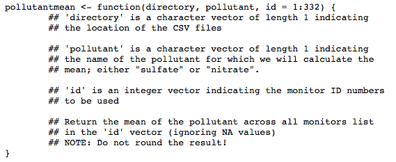

```{r setup, include=FALSE}
knitr::opts_chunk$set(echo = TRUE)
```

# Assignment Description

Below is the description of the assignment. It is copied from its source [here](https://www.coursera.org/learn/r-programming/supplement/amLgW/programming-assignment-1-instructions-air-pollution).

### Introduction

For this first programming assignment you will write three functions that are meant to interact with dataset that accompanies this assignment. The dataset is contained in a zip file **specdata.zip** that you can download from the Coursera web site.

Although this is a programming assignment, you will be assessed using a separate quiz.

### Data

The zip file containing the data can be downloaded here:

* [specdata.zip [2.4MB]](https://d396qusza40orc.cloudfront.net/rprog%2Fdata%2Fspecdata.zip)

The zip file contains 332 comma-separated-value (CSV) files containing pollution monitoring data for fine particulate matter (PM) air pollution at 332 locations in the United States. Each file contains data from a single monitor and the ID number for each monitor is contained in the file name. For example, data for monitor 200 is contained in the file "200.csv". Each file contains three variables:

* Date: the date of the observation in YYYY-MM-DD format (year-month-day)
* sulfate: the level of sulfate PM in the air on that date (measured in micrograms per cubic meter)
* nitrate: the level of nitrate PM in the air on that date (measured in micrograms per cubic meter)

For this programming assignment you will need to unzip this file and create the directory 'specdata'. Once you have unzipped the zip file, do not make any modifications to the files in the 'specdata' directory. In each file you'll notice that there are many days where either sulfate or nitrate (or both) are missing (coded as NA). This is common with air pollution monitoring data in the United States.

### Part 1

Write a function named 'pollutantmean' that calculates the mean of a pollutant (sulfate or nitrate) across a specified list of monitors. The function 'pollutantmean' takes three arguments: 'directory', 'pollutant', and 'id'. Given a vector monitor ID numbers, 'pollutantmean' reads that monitors' particulate matter data from the directory specified in the 'directory' argument and returns the mean of the pollutant across all of the monitors, ignoring any missing values coded as NA. A prototype of the function is as follows.



You can see some example output from this function below. The function that you write should be able to match this output. Please save your code to a file named pollutantmean.R.

[pollutantmean-demo.html](https://d3c33hcgiwev3.cloudfront.net/_3b0da118473bfa0845efddcbe29cc336_pollutantmean-demo.html?Expires=1579046400&Signature=QcID-GyJcmvOfSgH1vBjpzey2GPFIx1AN3XVyFfB97I0piR~b9pyszRVYQO1cVfweRctxarm0ZHY52oqv0AW7f24p9SB1tiukGRlxzOAnNE4KgoUl2gFb8FXmvQIWOtfqjx2PAJrdVfmKp73Z4iT652SHlB17h8o22kwmJsNWiQ_&Key-Pair-Id=APKAJLTNE6QMUY6HBC5A)

### Part 2

Write a function that reads a directory full of files and reports the number of completely observed cases in each data file. The function should return a data frame where the first column is the name of the file and the second column is the number of complete cases. A prototype of this function follows.


You can see some example output from this function below. The function that you write should be able to match this output. Please save your code to a file named complete.R. To run the submit script for this part, make sure your working directory has the file complete.R in it.

[complete-demo.html](https://d3c33hcgiwev3.cloudfront.net/_3b0da118473bfa0845efddcbe29cc336_complete-demo.html?Expires=1579046400&Signature=W4Umay74Lh-ob~DFVOvnVt4X3njMFbWkl53rmYac~V8-PPrTY8DT4L91zF9x4PLBxpNFvCA5vB7jqAGsr6S6F7rZ6vrKrcfTNbEVzK2gqO0e~V~tvtGqzM7N1dYt~BW0gnd1hPDUFvOKINK2Qs0Js3zh9sPAokLFOgHYGYvUjEo_&Key-Pair-Id=APKAJLTNE6QMUY6HBC5A)

### Part 3

Write a function that takes a directory of data files and a threshold for complete cases and calculates the correlation between sulfate and nitrate for monitor locations where the number of completely observed cases (on all variables) is greater than the threshold. The function should return a vector of correlations for the monitors that meet the threshold requirement. If no monitors meet the threshold requirement, then the function should return a numeric vector of length 0. A prototype of this function follows.


For this function you will need to use the 'cor' function in R which calculates the correlation between two vectors. Please read the help page for this function via '?cor' and make sure that you know how to use it.

You can see some example output from this function below. The function that you write should be able to approximately match this output. Note that because of how R rounds and presents floating point numbers, the output you generate may differ slightly from the example output. Please save your code to a file named corr.R. To run the submit script for this part, make sure your working directory has the file corr.R in it.

[corr-demo.html](https://d3c33hcgiwev3.cloudfront.net/_e92e575b8e62dcb1e3a086d2ff0d5a1e_corr-demo.html?Expires=1579046400&Signature=f7a54zvjc6hrc2UZ8R9ilx7Uhxw8kVJItmS~I61IBMwOnGshZGLmQGSUcLuBMOFDmwuXixosZf7gASy-O7bQaTG0S1m~xYsE3bZAzOGxCZ0TPmJzqH7olfD~~sOagS2Fk1Ucxy3VBDujozaKI9bNQ8gp-9Y4kSOADt4Usc6B-IU_&Key-Pair-Id=APKAJLTNE6QMUY6HBC5A)

# Solutions for the Assignment

As mentioned in the 

## R Markdown

This is an R Markdown document. Markdown is a simple formatting syntax for authoring HTML, PDF, and MS Word documents. For more details on using R Markdown see <http://rmarkdown.rstudio.com>.

When you click the **Knit** button a document will be generated that includes both content as well as the output of any embedded R code chunks within the document. You can embed an R code chunk like this:

```{r cars}
summary(cars)
```

## Including Plots

You can also embed plots, for example:

```{r pressure, echo=FALSE}
plot(pressure)
```

Note that the `echo = FALSE` parameter was added to the code chunk to prevent printing of the R code that generated the plot.
